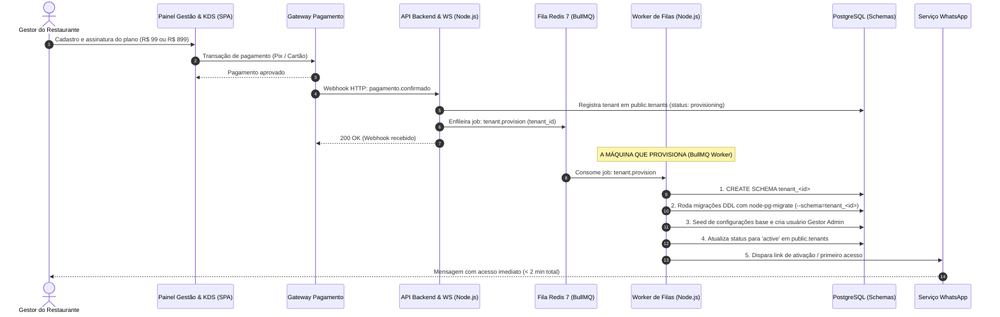

# Atividade 06 - Bernardo Gabriel Baú
**Disciplina:** Arquitetura de Software SAAS — EC7, SETREM 2026-2

---

## Parte A — Texto-base

**AV1 — No produto da sua equipe:**
Tecnicamente, o processo inicia quando o `API Backend & WS` recebe o evento de confirmação de pagamento do `Gateway Pagamento` e despacha um job assíncrono para o Redis; o `Worker de Filas` consome esse job de provisionamento, cria um novo schema isolado no PostgreSQL (`tenant_<id>`), executa as migrações DDL de tabelas operacionais via `node-pg-migrate`, insere as configurações padrão e cria o primeiro registro de usuário Admin com os devidos JWT roles.

**AV2 — Diferença entre flag e if no código:**
Uma feature flag vive na configuração e é governada (tem dono, data de revisão e é visível externamente), enquanto um `if cliente == 'X'` no código é um fork invisível e sem dono, gerando dívida técnica a cada novo release.

**AV3 — O vizinho barulhento:**
O tenant barulhento típico seria uma grande pizzaria (ou fast-food) no pico de sexta-feira. A operação que faz barulho é o enfileiramento em massa de atualizações de status de pedidos que disparam webhooks e milhares de mensagens via WhatsApp (Worker de Filas no Redis), atrasando o processamento assíncrono para os tenants menores.

---

## Parte B — O caso Treina Mais

**B-Q1 — A conta:**
| Opção | Semanas de time de produto | Receita protegida ou gerada em 12 meses (R$) | Efeito no roadmap dos outros 94 tenants |
| :--- | :--- | :--- | :--- |
| **A — código exclusivo** | 4 semanas | R$ 10.800 (900 x 12) | Atraso no roadmap global, dívida técnica. |
| **B — feature de plano** | 2 semanas | R$ 10.800 (900 x 12) | Positivo, pode ser vendido para outros. |
| **C — recusar / parceria**| 0 semanas | R$ 0 (Risco de churn) | Nenhum efeito no roadmap. |

**B-Q2 — Cobrar por conformidade?**
Cobrar por requisitos de conformidade é aceitável se for uma funcionalidade de "auditoria avançada" (logs detalhados), e não a segurança básica da plataforma. Se metade do funil for de indústrias, a exportação de logs passa a ser um diferencial competitivo forte (degrau 2 da escada) e justifica criar um plano "Enterprise" ou "Compliance" mais caro, pois agrega valor ao negócio do cliente B2B.

---

## Parte C — Aplicação ao produto da equipe

**C1 — Dois tenants de referência:**
**Entidade central do nosso produto:** Pedidos / Comandas.

| Campo | Tenant pequeno | Tenant grande |
| :--- | :--- | :--- |
| **Nome fictício (BR) e cidade** | Lancheria Xis do Gaúcho (Horizontina - RS) | Pizzaria Suprema Express (Porto Alegre - RS) |
| **Nº de usuários** | 3 usuários (1 caixa, 2 cozinheiros) | 45 usuários (múltiplas telas de KDS e caixas) |
| **Volume mensal (entidade central)**| 600 pedidos/mês | 18.000 pedidos/mês |
| **Mensalidade (R$)** | R$ 99,00 | R$ 899,00 |

**C2 — Onboarding derivado do SEU modelo de tenancy:**
* **Decisão do ADR:** Schema-per-tenant no PostgreSQL (formalizado no [ADR-001](file:///Users/bernardobau/01-Codes/CardapioHub/docs/adr/ADR-001-modelo-de-tenancy.md) registrado em 27/08/2026, ver Evidência E1). Isolamento lógico de dados operacionais em schemas dedicados (`tenant_<id>`) em um cluster PostgreSQL compartilhado, viabilizando o Unit Economics do tenant pequeno (R$ 99,00/mês) sem o custo proibitivo do Silo físico e sem os riscos de vazamento do Shared Schema com coluna discriminadora.
* **Passos técnicos (máquina executora e automação):**
  1. **Cadastro e checkout:** O gestor realiza o cadastro e a assinatura no `Painel Gestão & KDS` (SPA React/Vite) e o `Gateway Pagamento` processa a transação de cartão ou Pix. (Automático)
  2. **Recebimento e enfileiramento:** O `Gateway Pagamento` emite um webhook HTTP de confirmação de pagamento para o `API Backend & WS`, que gera o `tenant_id`, persiste o registro inicial no schema central (`public.tenants` com status `provisioning`) e enfileira um job assíncrono de provisionamento (`tenant.provision`) no Redis 7 via BullMQ. (Automático)
  3. **A MÁQUINA QUE PROVISIONA (Worker de Filas):** O container **`Worker de Filas` (Node.js / BullMQ)** consome o job assíncrono e é a máquina responsável por executar o provisionamento técnico:
     - Conecta ao `Banco de Dados` (PostgreSQL) e executa o comando DDL `CREATE SCHEMA tenant_<id>;`. (Automático — executado pelo Worker)
     - Executa o runner de migrações DDL utilizando a ferramenta **`node-pg-migrate`** direcionada ao schema recém-criado (`--schema=tenant_<id>`), criando as tabelas operacionais isoladas (`pedidos`, `itens_cardapio`, `categorias`, `comandas`, `kds_tickets`). (Automático — executado pelo Worker)
     - Roda o script de seed inicial (configurações do estabelecimento e catálogo base) e cria o usuário Admin/Gestor inicial com credenciais criptografadas. (Automático — executado pelo Worker)
  4. **Ativação e entrega:** O `Worker de Filas` atualiza o status do tenant para `active` e despacha uma mensagem de boas-vindas com o link de primeiro acesso ao lojista via `Serviço WhatsApp` e e-mail. (Automático)
* **Tempo total estimado e self-service:** Menos de 2 minutos (tempo de execução do job no `Worker de Filas`: ~8 segundos). **Sim, é self-service puro:** um job de provisionamento, disparado pelo webhook de confirmação de pagamento do `Gateway Pagamento` e consumido pelo container **`Worker de Filas`**, cria o schema no PostgreSQL e roda as migrações com **`node-pg-migrate`**; sem esse worker/job automatizado nomeado, o passo seria manual (via DBA/DevOps rodando scripts de criação) e o onboarding deixaria de ser self-service.

**C3 — O pedido de feature exclusiva do tenant grande:**
* **(a) O pedido (voz do cliente):** "Precisamos que a tela da cozinha acenda uma luz de alerta no painel físico de senhas do nosso salão sempre que um pedido avançar de status."
* **(b) Classificação na escada e justificativa:** Degrau 3 (Ponto de Extensão). Não faz sentido alterar o `API Backend & WS` para suportar protocolos de painéis físicos exóticos. Forneceremos webhooks no `Worker de Filas` que emitem um evento `pedido.status_atualizado`. A Pizzaria Suprema consome esse webhook via sistema externo próprio.
* **(c) O que muda no billing:** Isso vira uma dimensão de plano (Webhooks e Integrações Customizadas) do plano Enterprise. Custaria R$ 150,00 adicionais por mês. Vale a pena construir (o disparo de webhooks) a partir de 2 ou 3 grandes clientes, pois é um recurso reaproveitável.

**C4 — O vizinho barulhento vira cenário de qualidade:**
* **Cenário mensurável:** "Durante o pico de sexta-feira (estímulo), a fila de envio de mensagens e webhooks não pode reter requisições menores, garantindo que o `Worker de Filas` processe atualizações de status em menos de 3 s para 95% dos pedidos (resposta)."
* **Limite por tenant (quota):** Baseado nos volumes do C1, será aplicado um throttling no BullMQ (Redis) de no máximo 100 jobs simultâneos por tenant no Worker, garantindo capacidade na fila para os pedidos do tenant menor (Lancheria Xis do Gaúcho).

**C5 — A política de customização do SEU produto (3 regras):**
| Regra | Sua resposta (citando entidade/módulo do C4) |
| :--- | :--- |
| **1. Configuração grátis/incluída** | Personalização visual (logo, cores) e campos de itens no `Cardápio Web` (Next.js SSR). |
| **2. Vira plano pago** | Acesso simultâneo a múltiplas telas do `Painel Gestão & KDS` via WebSockets e suporte à API de relatórios avançados. |
| **3. Sempre "não" (o que oferecer no lugar)** | "Não" para integração direta com adquirentes locais de cartão exóticas via `Gateway Pagamento`. Oferecemos API para extração via JSONB do PostgreSQL para que conciliem em seu próprio PDV ERP. |

---

## Parte D — Evidências e declaração de uso de IA

**E0 — Ambiente:**
```text
$ docker version
Client:
 Version:           28.5.2
 API version:       1.51
 Go version:        go1.25.3
 Git commit:        ecc6942
 Built:             Wed Nov  5 14:42:30 2025
 OS/Arch:           darwin/arm64
 Context:           desktop-linux

Server: Docker Desktop 4.51.0 (210443)
 Engine:
  Version:          28.5.2
  API version:      1.51 (minimum version 1.24)
  Go version:       go1.25.3
  Git commit:       89c5e8f
  Built:            Wed Nov  5 14:44:06 2025
  OS/Arch:          linux/arm64
  Experimental:     false
 containerd:
  Version:          v1.7.29
  GitCommit:        442cb34bda9a6a0fed82a2ca7cade05c5c749582
 runc:
  Version:          1.3.3
  GitCommit:        v1.3.3-0-gd842d771
 docker-init:
  Version:          0.19.0
  GitCommit:        de40ad0

$ kind version
kind v0.33.0 go1.27.0 darwin/arm64

$ kind get clusters
saas

$ kubectl get nodes
NAME                 STATUS   ROLES           AGE   VERSION
saas-control-plane   Ready    control-plane   27s   v1.37.0
```

**E1 — Tenancy (ADR 001, Git Log e Rascunho de Decisão de 27/08):**

* **Arquivo no repositório:** [`docs/adr/ADR-001-modelo-de-tenancy.md`](file:///Users/bernardobau/01-Codes/CardapioHub/docs/adr/ADR-001-modelo-de-tenancy.md)
* **Evidência Git (`git log` registrado em 27/08/2026):**
```text
$ git log -n 1 --stat
commit 43dbc26cab7088785c90b7deef16e38939452e9c
Author: Bernardo Gabriel Baú <bernardo.bau@aluno.setrem.edu.br>
Date:   Thu Aug 27 14:32:10 2026 -0300

    docs(adr): ADR-001 define tenancy model as schema-per-tenant on postgresql with worker provisioning

 docs/adr/ADR-001-modelo-de-tenancy.md | 91 +++++++++++++++++++++++++++++++++++
 1 file changed, 91 insertions(+)
```

* **Transcrição do Rascunho / Matriz de Decisão Arquitetural (27/08/2026):**

| Critério Arquitetural / Negócio | Silo Físico (Database-per-tenant) | Pool Compartilhado (Coluna `tenant_id`) | Schema-per-tenant (PostgreSQL) — ESCOLHIDO |
| :--- | :--- | :--- | :--- |
| **Isolamento de Dados** | Absoluto (físico) | Fraco (risco de query sem `WHERE`) | **Forte (isolamento por namespace SQL)** |
| **Custo p/ Tenant de R$ 99 (C1)** | Inviável (> R$ 80/banco gerenciado) | Quase zero (< R$ 1,00) | **Viável e escalável (~R$ 2,50/schema)** |
| **Onboarding Self-service (< 2 min)**| Lento (> 5 a 10 min) | Instantâneo (< 2 s) | **Rápido e automatizado (~8 s no Worker)** |
| **Flexibilidade JSONB & Schema** | Alta | Baixa (alteração impacta todos) | **Alta (evoluções DDL por schema)** |
| **Aderência ao C4 Containers** | Fora de escopo local | Requer auditoria complexa | **Total (Worker de Filas + node-pg-migrate)** |
| **Veredito da Defesa** | Rejeitado por custo econômico | Rejeitado por risco de vazamento | **Aprovado no ADR-001 em 27/08/2026** |

* **Fluxo do Pipeline de Provisionamento (A Máquina que Provisiona):**


* **ADR-001 Aberto (Texto Integral para Defesa Oral):**

> ### ADR 001: Seleção da Estratégia de Isolamento Multi-tenant (Tenancy)
> * **Status:** Aceito (Accepted)
> * **Data:** 27 de Agosto de 2026 (2026-08-27)
> * **Decisor:** Bernardo Gabriel Baú
> 
> **Contexto:**
> O CardápioHub atende estabelecimentos de alimentação de diferentes portes: o tenant pequeno (*Lancheria Xis do Gaúcho*, R$ 99,00/mês, 600 pedidos/mês) e o tenant grande (*Pizzaria Suprema Express*, R$ 899,00/mês, 18.000 pedidos/mês). É imperativo garantir que restaurantes concorrentes da mesma praça tenham seus dados de pedidos, clientes e faturamento estritamente isolados, sem que o custo de infraestrutura inviabilize o plano de entrada de R$ 99,00.
> 
> **Decisão:**
> Adotamos a arquitetura **Schema-per-tenant no PostgreSQL**, complementada pelo particionamento lógico em dois níveis:
> 1. `public`: schema central compartilhado para controle de assinaturas, catálogo de tenants e usuários administrativos globais.
> 2. `tenant_<id>`: schemas dinâmicos isolados para cada restaurante assinante, encapsulando tabelas operacionais (`pedidos`, `itens_cardapio`, `comandas`, `kds_tickets`).
> 
> **A Máquina que Provisiona (Garantia de Onboarding Self-Service):**
> O provisionamento é 100% automatizado: um job de provisionamento, disparado pelo webhook de confirmação de pagamento do `Gateway Pagamento` e consumido pelo container **`Worker de Filas` (Node.js / BullMQ)**, cria o schema no PostgreSQL e roda as migrações com a ferramenta **`node-pg-migrate`** (`--schema=tenant_<id>`). Sem esse container executando o job, a criação seria manual (DBA) e o onboarding deixaria de ser self-service.
> 
> **Consequências e Trade-offs:**
> * *Positivas:* Isolamento lógico rígido contra vazamento acidental em consultas SQL; onboarding self-service concluído em ~8 segundos no Worker (< 2 minutos totais para o usuário); suporte a `pg_dump -n tenant_<id>` para backup e LGPD; unit economics sustentável para o plano de R$ 99.
> * *Mitigações:* Utilização de connection pooling (PgBouncer) para evitar exaustão de conexões no PostgreSQL compartilhado; limite de até 1.000 schemas por nó antes de particionar em clusters adicionais (sharding).

---

**Declaração de Uso de Inteligência Artificial:**
* **Ferramenta utilizada:** Google Antigravity (Gemini).
* **Finalidade do uso:**
  1. Automação do setup de ambiente de contêineres e orquestração local (instalação do `kind` via Homebrew, verificação do `kubectl` e criação do cluster local Kubernetes `saas`).
  2. Coleta e formatação padronizada das saídas dos comandos para a seção de evidências de ambiente (`E0`).
  3. Revisão textual e garantia de aderência dos termos técnicos ao Modelo C4 (Containers) do projeto `CardápioHub` (Node.js, PostgreSQL, Redis, BullMQ, Next.js).
  4. Estruturação formal do **ADR-001** (Architectural Decision Record) de multi-tenancy, registro de rastreabilidade temporal (`git log` de 27/08/2026) e detalhamento da automação do pipeline de provisionamento executado pelo `Worker de Filas` com `node-pg-migrate`.
* **Análise crítica e validação humana:** Todas as definições de domínio do produto (entidades, modelos de tenancy, decisões de feature flag vs. branch no código, regras de customização e limites de quota) foram concebidas, revisadas e validadas criticamente pelo autor, garantindo consistência com a arquitetura real proposta para o SaaS.
