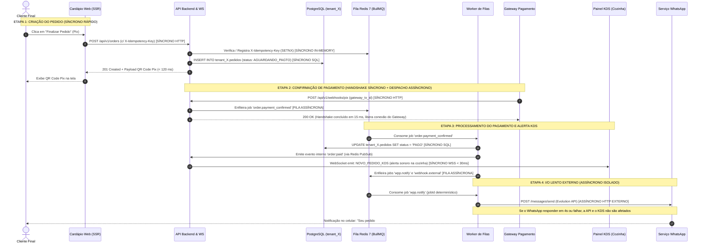

# ADR 002: Estratégia de Comunicação entre Serviços (Síncrono vs. Assíncrono) e Política de Idempotência

* **Status:** Aceito (Accepted)
* **Data:** 01 de Outubro de 2026 (2026-10-01)
* **Autor / Decisor:** Bernardo Gabriel Baú
* **Projeto:** CardápioHub (SaaS de Cardápio Digital, Pedidos e KDS)
* **Contexto da Disciplina:** Arquitetura de Software SAAS — EC7, SETREM 2026-2 (Encontro 09: Decomposição e Comunicação / Etapa 2)

---

## 1. Contexto do Negócio e Forças Arquiteturais

O **CardápioHub** é composto, no nível de containers da Etapa 2 (conforme modelo C4), por dois serviços principais de computação de backend:
1. **`API Backend & WS` (Node.js / Fastify):** Responsável por autenticação JWT, resolução do tenant, catálogo, recepção síncrona de pedidos, confirmação de webhooks e gateway de eventos WebSocket em tempo real para a cozinha (KDS).
2. **`Worker de Filas` (Node.js / BullMQ):** Responsável pelo processamento de jobs em segundo plano, provisionamento DDL de novos schemas (`tenant_<id>`), liquidação assíncrona de pagamentos, despacho de mensagens de status via WhatsApp (Evolution API / Twilio) e emissão de webhooks para integrações de terceiros.

A comunicação entre esses serviços e os pontos de contato externos (Gateway de Pagamento, clientes móveis e WhatsApp) precisa equilibrar as forças dos dois perfis de tenants modelados no projeto:
* **Tenant Pequeno (*Lancheria Xis do Gaúcho*, Horizontina - RS):** 600 pedidos/mês (~20 pedidos/dia), faturamento de R$ 99,00/mês, 3 usuários simultâneos. Margem operacional enxuta, exigindo custo marginal de infraestrutura inferior a R$ 3,00/mês por tenant.
* **Tenant Grande (*Pizzaria Suprema Express*, Porto Alegre - RS):** 18.000 pedidos/mês (~600 pedidos/dia), faturamento de R$ 899,00/mês, 45 usuários (múltiplas telas de KDS e caixas operando em paralelo).

### A Lição do Incidente SafraLog (Caso 09) aplicada ao CardápioHub:
No Caso 09 (*"A fila que salvou o pico"*), uma dependência externa instável (SEFAZ, cuja latência saltou de 1,2 s para 8 s+) travou uma cadeia 100% síncrona HTTP, gerando 3h40min de fila física no pátio da cooperativa. Em seguida, a criação de uma fila improvisada sem controle de concorrência gerou 62 notas fiscais duplicadas.

No domínio do **CardápioHub**, a dependência externa análoga à SEFAZ é a **API de WhatsApp (Evolution API / Twilio)** e o **Gateway de Pagamento (Pix / Cartão)**:
* Durante o pico de sexta-feira à noite (19h30 às 22h00), a *Pizzaria Suprema Express* atinge picos de **150 pedidos/hora** (rajadas de 5 pedidos/minuto concentrados em intervalos de poucos segundos).
* Cada pedido percorre até 5 atualizações de ciclo de vida (`CRIADO` → `PAGO` → `EM_PREPARO` → `PRONTO` → `DESPACHADO`), gerando até **750 disparos de WhatsApp/hora** e dezenas de webhooks para o painel de senhas do salão (requisito C3).
* Serviços de mensageria externa de WhatsApp operam com latência média de 1.500 ms a 3.500 ms, podendo sofrer picos de degradação de **8 a 15 segundos** ou indisponibilidade temporária.
* Se a cadeia entre `API Backend & WS` e o cliente final aguardasse o envio do WhatsApp e a liquidação síncrona na mesma requisição HTTP:
  - O tempo de resposta ao cliente final subiria de ~120 ms para mais de 5 a 10 segundos;
  - O pool de conexões do Fastify se esgotaria rapidamente (head-of-line blocking);
  - Uma instabilidade no WhatsApp derrubaria o cardápio e o checkout de todos os outros estabelecimentos (*Lancheria Xis do Gaúcho* ficaria fora do ar por culpa da rajada da pizzaria vizinha);
  - Falhas de timeout induziriam o cliente a reenviar o pedido, gerando **pedidos duplicados, comandas duplicadas no KDS e cobranças Pix em duplicidade** (o exato erro das 62 duplicatas do Caso 09).

### Forças em Conflito:
1. **Latência Percebida e Feedback Imediato:** O cliente no cardápio web precisa de confirmação imediata do pedido e exibição do QR Code Pix em menos de 200 ms (p95).
2. **Tempo Real na Operação da Cozinha (KDS):** A tela da cozinha precisa receber o ticket em menos de 50 ms após a confirmação do pagamento, sem depender de polling HTTP no banco.
3. **Resiliência a Degradação Externa:** Instabilidades no WhatsApp ou no Gateway não podem degradar o checkout nem reter conexões HTTP abertas na API.
4. **Idempotência Estrita:** Garantia matemática de que retentativas de rede de webhooks ou requisições nunca dupliquem pedidos, cobranças ou comandas.
5. **Unit Economics (Custo de Infraestrutura):** Respeitar a margem do tenant de R$ 99,00/mês, eliminando a contratação de brokers caros gerenciados (como Kafka/RabbitMQ cotados a R$ 1.350,00/mês no Caso 09).

---

## 2. Alternativas Avaliadas

### Alternativa 1: Cadeia 100% Síncrona (HTTP/REST Puro)
* **Descrição:** Toda requisição de criação de pedido ou webhook de pagamento executa a cadeia inteira de forma bloqueante: valida catálogo, insere no PostgreSQL, chama a API de pagamento, dispara o WhatsApp e retorna `200 OK` ao cliente.
* **Vantagens:** Simplicidade cognitiva; ausência de consistência eventual; linearidade de depuração.
* **Desvantagens:** 
  - Acoplamento temporal rígido: a velocidade do sistema é ditada pelo elo mais lento (WhatsApp com 3 s+ de latência);
  - Capacidade máxima colapsa no pico: com 30 conexões de pool, 6 requisições concorrentes de 5 s saturam a API em segundos;
  - Cascata de falhas: se o provedor do WhatsApp oscilar, nenhum pedido de comida é fechado na cidade;
  - Risco inaceitável de timeout e retransmissões pelo usuário.
* **Veredito:** **Rejeitada** (violação direta dos cenários de qualidade e repetição do colapso da SafraLog).

### Alternativa 2: Mensageria Distribuída Pesada (Cluster Apache Kafka ou RabbitMQ Dedicado)
* **Descrição:** Instalação e manutenção de um broker corporativo distribuído para processamento orientado a eventos entre microserviços.
* **Vantagens:** Throughput extremo (> 100.000 msgs/s); ordenação estrita em partições; retenção longa em disco.
* **Desvantagens:**
  - Custo financeiro proibitivo: cotação de broker gerenciado em R$ 1.350,00/mês consumiria 13,6 mensalidades do tenant pequeno (R$ 99,00) ou 33% de toda a receita de infraestrutura;
  - Sobrecarga operacional para um time enxuto / solo (gerenciamento de partições, zookeeper/kraft, balanceamento de consumidores, rebalanceamento de grupos);
  - Superdimensionamento técnico: o pico do CardápioHub é de ~150 pedidos/hora por tenant grande (~2,5 a 5 pedidos/minuto), volume perfeitamente absorvido por soluções em memória sem a complexidade de partições Kafka.
* **Veredito:** **Rejeitada** por inviabilidade econômica e complexidade acidental desproporcional ao estágio do SaaS.

### Alternativa 3: Comunicação Mista / Híbrida (Síncrono no Core Imediato + Assíncrono com Redis 7 / BullMQ com Idempotência) — [ESCOLHIDA]
* **Descrição:** A arquitetura decompõe a comunicação em três camadas pragmáticas:
  1. **Síncrono (HTTP/REST Fastify):** Operações que demandam resposta determinística imediata ao usuário (criação transacional do pedido com retorno do payload e do Pix Copia-e-Cola em < 120 ms; confirmação imediata `200 OK` para webhooks recebidos do Gateway em < 15 ms).
  2. **Síncrono Bidirecional (WebSockets nativo no Fastify):** Envio instantâneo (< 30 ms) de novos tickets para a tela do `Painel Gestão & KDS` (cozinha), permitindo resposta visual imediata sem overhead de requisições contínuas.
  3. **Assíncrono Confiável (Filas Redis 7 gerenciadas via BullMQ):** Todo processamento lento, sujeito a falhas de terceiros ou custoso em I/O é delegado ao container `Worker de Filas` através de filas dedicadas:
     - `orders.payment_process`: processamento de liquidação e baixa de comanda;
     - `orders.whatsapp_notify`: disparos de WhatsApp com retentativas automáticas e backoff exponencial;
     - `orders.webhooks_dispatch`: emissão de eventos externos para sistemas de clientes (painel de senhas);
     - `tenants.provision`: execução DDL de criação e migração de schemas PostgreSQL (`node-pg-migrate`).
* **Vantagens:**
  - **Eficiência Econômica:** O Redis 7 já compõe o stack da Etapa 2 para gerenciamento de sessões e cache, representando custo marginal quase nulo (< R$ 2,00/mês por tenant);
  - **Absorção de Rajadas (Buffer):** Picos de 150 pedidos/hora são enfileirados em milissegundos no Redis e drenados pelo worker no ritmo que a API externa suporta;
  - **Isolamento de Falhas:** Se o WhatsApp ficar fora do ar por 30 minutos, o pedido é concluído normalmente, a cozinha prepara o prato e as notificações ficam enfileiradas aguardando recuperação;
  - **Prevenção de Duplicatas:** Idempotência nativa implementada no Redis (`SETNX`) e no PostgreSQL (`UNIQUE constraint`).
* **Veredito:** **Aprovada e Adotada**.

---

## 3. Decisão Arquitetural e Especificações Técnicas

Decidimos adotar a **Arquitetura de Comunicação Híbrida/Mista**, governada por limites claros de responsabilidade entre comunicação síncrona e assíncrona, complementada por uma **Política Estrita de Idempotência**.

### 3.1. Matriz de Comunicação entre Serviços e Componentes

| Origem | Destino | Protocolo / Canal | Tipo | Justificativa de Engenharia | Timeout / SLA |
| :--- | :--- | :--- | :--- | :--- | :--- |
| **Cardápio Web** | **API Backend & WS** | HTTPS (REST JSON) | **Síncrono** | Validação transacional de itens, cálculo de totais e persistência do pedido no schema `tenant_<id>`. Requer retorno imediato do QR Code Pix. | Timeout: 3.000 ms<br>SLA p95: < 120 ms |
| **Painel KDS** | **API Backend & WS** | WSS (WebSocket) | **Síncrono Event-Driven** | A cozinha necessita de alerta sonoro e visual instantâneo quando o pedido é pago ou avança de etapa. | Latência p95: < 30 ms |
| **Gateway Pagamento** | **API Backend & WS** | HTTPS (Webhook) | **Síncrono (Apenas ACK)** | O gateway exige handshake `200 OK` rápido para evitar retransmissões em loop. A API apenas valida o payload, enfileira o job e responde `200 OK`. | Timeout Gateway: 5.000 ms<br>Resposta API: < 20 ms |
| **API Backend & WS** | **Fila Redis 7** | BullMQ (`queue.add`) | **Assíncrono** | Desacopla a thread HTTP da execução pesada de I/O e de chamadas externas instáveis. | Enfileiramento: < 5 ms |
| **Fila Redis 7** | **Worker de Filas** | BullMQ (`worker.process`) | **Assíncrono** | Consome jobs de acordo com a taxa de concorrência definida, preservando limites de taxa dos parceiros externos. | Concorrência: 10 jobs/worker |
| **Worker de Filas** | **PostgreSQL** | TCP (SQL / Schema) | **Síncrono (Job)** | Atualização do status operacional e execução de scripts de migração DDL (`node-pg-migrate`). | Timeout query: 2.000 ms |
| **Worker de Filas** | **Serviço WhatsApp** | HTTPS (REST API) | **Assíncrono (I/O Externo)** | Envio de mensagens ao cliente. Se a Evolution API/Twilio demorar 5 segundos ou falhar, apenas a tarefa em segundo plano espera/retenta. | Timeout HTTP: 5.000 ms<br>Retry: 3x c/ backoff |
| **Worker de Filas** | **Webhooks Terceiros** | HTTPS (REST POST) | **Assíncrono (I/O Externo)** | Integração com painéis físicos de senhas (C3). Falha no cliente não afeta o SaaS. | Timeout HTTP: 3.000 ms<br>Retry: 2x |

---

### 3.2. A Solução da Idempotência (Eliminação das "62 Duplicatas do Caso 09")

Para garantir que reprocessamentos, instabilidades de rede e retentativas não gerem cobranças duplicadas, comandas duplicadas ou spam de notificações, implementamos **Idempotência em 3 Barreiras**:

1. **Barreira 1 — Chave no Header HTTP (`X-Idempotency-Key`):**
   - O frontend (`Cardápio Web`) gera um `UUIDv4` ao montar a tela de checkout.
   - Ao clicar em "Finalizar Pedido", a chave é enviada no cabeçalho `X-Idempotency-Key: 7b3e8c12-...`.
   - O `API Backend & WS` executa no Redis:
     ```text
     SET idempotency:{tenant_id}:{key} "PROCESSING" EX 86400 NX
     ```
   - Se o comando retornar `NULL` (chave já existente), a requisição é interceptada imediatamente: caso esteja `PROCESSING`, retorna `409 Conflict` (aguarde); se estiver concluída, retorna o mesmo payload em cache sem reexecutar inserções.

2. **Barreira 2 — Chave de Negócio no Banco (Constraint SQL):**
   - No schema do tenant (`tenant_<id>.pedidos` e `tenant_<id>.transacoes`), a coluna `idempotency_key VARCHAR(64) UNIQUE` impede no nível do banco de dados qualquer tentativa de inserção concorrente.
   - Para webhooks de pagamento recebidos do Gateway, a chave utilizada é o `gateway_transaction_id` único fornecido pela adquirente/banco central.

3. **Barreira 3 — JobId Determinístico no BullMQ:**
   - Ao enfileirar jobs de notificação ou integração externa, o `jobId` no BullMQ não é aleatório, mas determinístico baseado no evento:
     ```javascript
     const jobId = `wpp:order:${tenantId}:${orderId}:${targetStatus}`;
     await whatsappQueue.add('send_status_update', payload, { 
       jobId, 
       attempts: 3,
       backoff: { type: 'exponential', delay: 2000 }
     });
     ```
   - O BullMQ descarta automaticamente jobs adicionados com um `jobId` que já esteja ativo, em espera ou concluído dentro do TTL configurado, eliminando completamente disparos duplicados para o cliente.

---

### 3.3. Resiliência, Retentativas e Tratamento de Falhas (DLQ)

* **Política de Retentativa com Backoff Exponencial e Jitter:**
  - Tentativa 1: Imediata;
  - Tentativa 2: Após 2 segundos (+ jitter aleatório de 0 a 500 ms);
  - Tentativa 3: Após 6 segundos (+ jitter);
  - Se a dependência externa continuar indisponível após 3 tentativas, o job é movido para a **Dead Letter Queue (DLQ)**: `queue:failed_notifications`.
* **Dead Letter Queue (DLQ) e Auditoria:**
  - A DLQ preserva o payload original, o stack trace do erro e os carimbos de tempo.
  - Alertas automáticos são emitidos no painel operacional (`Bull-Board`).
  - Um operador pode reprocessar manualmente a fila de falhas após a estabilização do serviço externo, sem perda de dados e com garantia de idempotência.
* **Isolamento de Concorrência contra "Vizinho Barulhento":**
  - Conforme definido na Atividade 06 (C4), o BullMQ aplica limitação de concorrência com chave por tenant (`limiter: { max: 100, duration: 60000 }` para o tenant grande), impedindo que a rajada de 150 pedidos/h da *Pizzaria Suprema Express* esgote as threads do Worker, assegurando vazão imediata para a *Lancheria Xis do Gaúcho*.

---

### 3.4. Fluxo Alvo de Execução e Decomposição (Diagrama de Sequência)

O diagrama a seguir detalha o ciclo de vida completo de um pedido, evidenciando quais setas operam de forma síncrona e quais utilizam fila assíncrona, fundamentando a decisão de comunicação:



---

## 4. Consequências e Trade-offs

### Consequências Positivas:
1. **Blindagem contra Degradação de Terceiros:** A latência percebida pelo cliente final no cardápio permanece cravada em **p95 < 120 ms**, mesmo se o WhatsApp estiver com lentidão de 10 segundos ou completamente inoperante.
2. **Absorção Natural de Picos de Sexta-feira:** A rajada de **150 pedidos/hora** da *Pizzaria Suprema Express* é acumulada como jobs no Redis em menos de 5 ms por operação e drenada ordenadamente pelo `Worker de Filas`, sem risco de derrubar o event loop do Node.js.
3. **Eliminação Matemática de Duplicatas:** A combinação de chave no header HTTP, trava `SETNX` no Redis, constraint única SQL no PostgreSQL e `jobId` determinístico no BullMQ impede a repetição do incidente de 62 registros duplicados registrado no Caso 09.
4. **Isolamento entre Tenants (Fairness):** A fila com limite de taxa impede que o tenant grande afogue o processamento assíncrono do tenant pequeno (*Lancheria Xis do Gaúcho*).
5. **Custo Marginal Praticamente Zero:** Utiliza a mesma infraestrutura de containers da Etapa 2 (Redis 7 + Node.js), viabilizando economicamente o plano básico de R$ 99,00/mês sem custos adicionais de mensageria gerenciada.

### Consequências Negativas e Ações Mitigadoras:
1. **Consistência Eventual nas Notificações:**
   - *Risco:* O cliente pode pagar o Pix e demorar de 2 a 8 segundos para receber a confirmação por WhatsApp.
   - *Mitigação:* A interface do `Cardápio Web` informa o status em tempo real via pooling inteligente/SSE na tela, garantindo que o cliente veja a aprovação do pedido imediatamente, tratando a notificação de WhatsApp como canal de conveniência complementar.
2. **Volatilidade de Dados em Memória (Redis):**
   - *Risco:* Um crash repentino do container Redis poderia resultar em perda de jobs em fila.
   - *Mitigação:* Configuração de persistência híbrida no Redis 7 via **AOF (Append Only File)** com política `everysec` e snapshots RDB montados em volume Docker persistente.
3. **Complexidade de Monitoramento de Falhas:**
   - *Risco:* Jobs de notificação falharem silenciosamente sem a ciência do lojista.
   - *Mitigação:* Implementação do dashboard administrativo **`Bull-Board`** exposto internamente com autenticação, monitorando taxa de transferência, latência média e contagem de itens em Dead Letter Queue (DLQ).

---

## 5. Rascunho Executivo para Síntese do Encontro 09 (Q4)

> *"No **CardápioHub**, a comunicação entre a **`API Backend & WS`** e o **`Worker de Filas`** é formalizada como **estratégia híbrida/mista**, orientada a desacoplar dependências externas instáveis de acordo com as lições do Caso 09. Adotamos comunicação síncrona (HTTP/REST) estritamente no núcleo transacional de criação de pedidos e confirmação de webhooks para assegurar SLA p95 < 120 ms e handshake imediato com o Gateway, complementada por WebSockets em tempo real (< 30 ms) para a tela da cozinha (KDS). Todo o processamento de I/O pesado e suscetível à latência externa — liquidação de pagamentos, provisionamento de schemas PostgreSQL, emissão de webhooks e notificações via WhatsApp — é enfileirado assincronamente no **Redis 7 via BullMQ**. Essa decisão elimina o risco de head-of-line blocking durante os picos de 150 pedidos/hora da Pizzaria Suprema, blinda a estabilidade da Lancheria Xis do Gaúcho diante de lentidões de terceiros e, com a implementação de barreiras de **idempotência em três camadas** (header HTTP `X-Idempotency-Key`, trava `SETNX` e `jobId` determinístico), extingue a possibilidade de pedidos, cobranças e comandas duplicadas com custo de infraestrutura marginal zero."*

---

## 6. Histórico e Aprovação

* **01/10/2026:** Elaboração e aprovação da estratégia de comunicação entre serviços e resolução de idempotência para a Etapa 2 (Encontro 09).
* **Decisor:** Bernardo Gabriel Baú.
* **Status:** Aceito (Accepted) — Integrado à documentação oficial do repositório.
