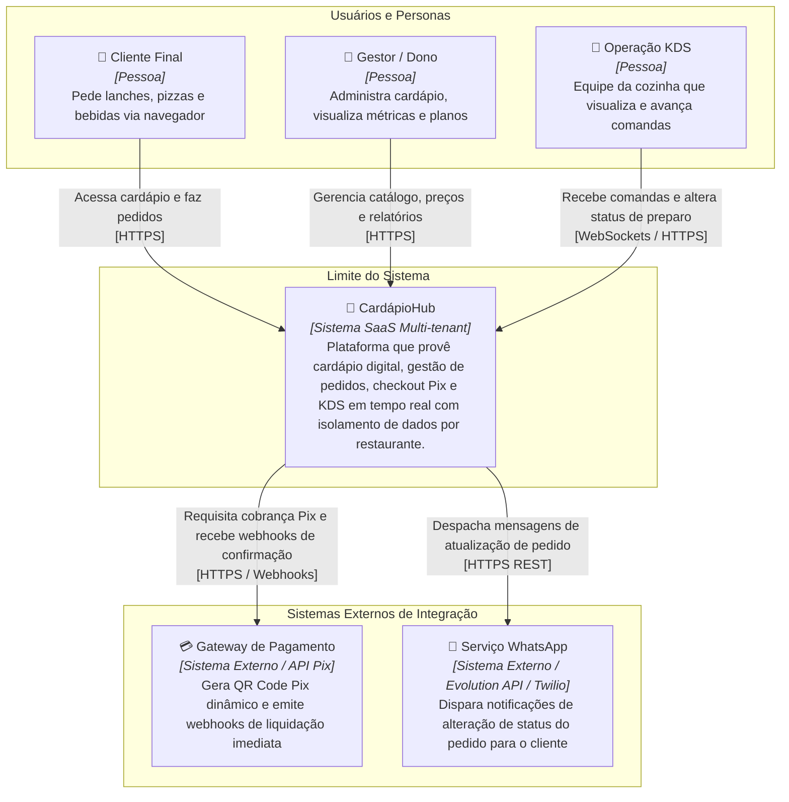

# C4 Model — Nível 1: Diagrama de Contexto do Sistema

**Projeto:** CardápioHub (SaaS Multi-tenant de Cardápio Digital, Pedidos e KDS)  
**Autor:** Bernardo Gabriel Baú  
**Visualização Gráfica Interativa:** [diagrama.html](file:///Users/bernardobau/01-Codes/CardapioHub/docs/c4/diagrama.html)

---

## 1. Diagrama de Contexto (Mermaid)

---

## 2. Descrição das Entidades e Fronteiras

### Usuários (Personas):
* **Cliente Final:** O consumidor do restaurante que acessa a URL pública (ex.: `cardapiohub.com.br/xis-gaucho`) via smartphone no salão ou em casa, sem autenticação prévia, seleciona os pratos, adiciona complementos e realiza o pagamento Pix.
* **Gestor / Dono do Restaurante:** Administrador que assina o plano SaaS, configura horários de funcionamento, cadastra categorias e itens no cardápio, monitora o faturamento em tempo real e visualiza o histórico de pedidos.
* **Operação KDS (Equipe da Cozinha):** Chapeiros, pizzaiolos e montadores que operam telas touchscreen ou monitores na cozinha, acompanhando as comandas ordenadas por tempo de espera e avançando os status de preparo.

### O Sistema CardápioHub:
* Solução central multi-tenant hospedada na nuvem que encapsula toda a regra de negócio de gestão de cardápios, pedidos, comandas, roteamento seguro por tenant e comunicação em tempo real.

### Sistemas Externos:
* **Gateway de Pagamento (Pix / Cartão):** Processador financeiro responsável pela emissão de cobranças Pix do Banco Central e envio de webhooks HTTP assíncronos quando o pagamento é reconhecido.
* **Serviço WhatsApp (Evolution API / Twilio):** Plataforma externa de mensageria responsável por entregar notificações automáticas de confirmação e despacho direto no celular do cliente final.
