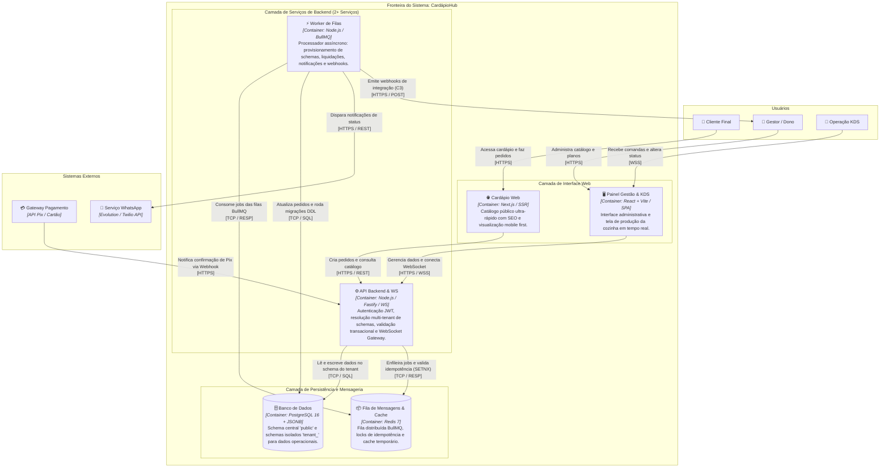

# C4 Model — Nível 2: Diagrama de Containers

**Projeto:** CardápioHub (SaaS Multi-tenant de Cardápio Digital, Pedidos e KDS)  
**Autor:** Bernardo Gabriel Baú  
**Visualização Gráfica Interativa:** [Diagrama_C4_Nivel2-Containers.html](file:///Users/bernardobau/01-Codes/CardapioHub/docs/c4/Diagrama_C4_Nivel2-Containers.html)

---

## 1. Diagrama de Containers (Mermaid)

---

## 2. Especificação Técnica dos Containers

| Container | Tecnologia | Papel Arquitetural | Estratégia de Isolamento Multi-tenant |
| :--- | :--- | :--- | :--- |
| **Cardápio Web** | Next.js 14 (SSR / React) | Aplicação web pública voltada ao consumidor final. Renderiza o cardápio com baixa latência, suporte a SEO e checkout. | Identifica o restaurante através do subdomínio ou path (`/restaurante-slug`). |
| **Painel Gestão & KDS** | React 18 + Vite (SPA) | Aplicação web administrativa e tela de produção da cozinha. Conecta via WebSockets para feedback em tempo real. | JWT assinado contendo `tenant_id` e permissões de acesso (`ADMIN`, `CAIXA`, `COZINHA`). |
| **API Backend & WS** | Node.js 20 + Fastify + WS | Serviço HTTP REST e WebSocket Gateway. É a porta de entrada síncrona para todas as mutações e leituras. | Middleware Fastify extrai `tenant_id` do JWT e aplica `SET LOCAL search_path = tenant_<id>, public` por requisição. |
| **Worker de Filas** | Node.js 20 + BullMQ | Serviço de segundo plano responsável por drenar filas, provisionar novos tenants (`node-pg-migrate`) e executar I/O bloqueante. | Conecta ao PostgreSQL com privilégios de DDL e executa migrações direcionadas ao schema específico (`--schema=tenant_<id>`). |
| **Banco de Dados** | PostgreSQL 16 + JSONB | Armazenamento relacional e semi-estruturado. Suporta colunas JSONB para itens opcionais dinâmicos. | **Schema-per-tenant:** `public` para governança SaaS; `tenant_<id>` para tabelas operacionais isoladas. |
| **Fila de Mensagens** | Redis 7 Alpine | Gerenciamento de filas BullMQ, cache de idempotência com TTL e pub/sub de eventos internos. | Prefixos de chaves delimitados por tenant (`idempotency:{tenant_id}:{key}`). |

---

## 3. Limites de Tenant e Comunicação (Aderência à Etapa 2)

* **Dois Serviços de Backend Mapeados:** `API Backend & WS` e `Worker de Filas` operam como processos desacoplados, cumprindo o requisito de "2+ serviços" da Etapa 2.
* **Comunicação Justificada:** Conforme formalizado no [ADR-002](file:///Users/bernardobau/01-Codes/CardapioHub/docs/adr/ADR-002-estrategia-de-comunicacao-entre-servicos.md), a comunicação entre eles é assíncrona orientada a filas através do Redis 7 (BullMQ), eliminando o risco de colapso de requisições síncronas observado no Caso 09.
