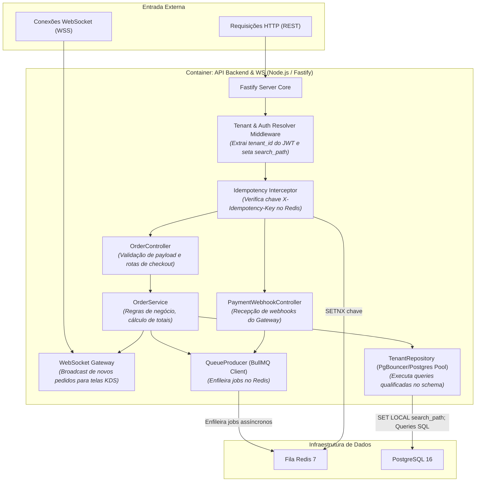
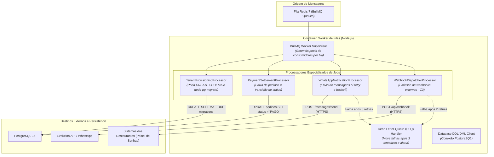

# C4 Model — Nível 3: Diagrama de Componentes (Componentes Críticos)

**Projeto:** CardápioHub (SaaS Multi-tenant de Cardápio Digital, Pedidos e KDS)  
**Autor:** Bernardo Gabriel Baú  
**Escopo:** Decomposição interna dos dois serviços de backend da Etapa 2 (`API Backend & WS` e `Worker de Filas`)

---

## 1. Componentes da `API Backend & WS` (Node.js / Fastify)

A `API Backend & WS` é o ponto de entrada síncrono para o tráfego HTTP e conexões persistentes WebSocket.

### Componentes Internos e Responsabilidades:
1. **`Tenant & Auth Resolver Middleware`:** Intercepta todas as requisições autenticadas, decodifica o JWT, valida a assinatura e extrai o `tenant_id`. No momento de checkout público, resolve o tenant pelo header `X-Tenant-Domain` ou path. Configura na conexão do pool: `SET LOCAL search_path TO tenant_<id>, public;`.
2. **`Idempotency Interceptor`:** Consulta atômica via `SETNX` no Redis. Bloqueia requisições duplicadas de checkout antes de atingir o banco de dados.
3. **`OrderController` & `OrderService`:** Valida a integridade dos itens em relação ao cardápio ativo, calcula adicionais JSONB e persiste a transação.
4. **`WebSocket Gateway`:** Mantém o pool de conexões com os navegadores do KDS na cozinha. Quando um pedido é confirmado, emite um evento no canal do tenant (`room:tenant_<id>:kds`).
5. **`QueueProducer`:** Encapsula a biblioteca BullMQ, inserindo jobs nas filas correspondentes com `jobId` determinístico.

---

## 2. Componentes do `Worker de Filas` (Node.js / BullMQ)

O `Worker de Filas` é a máquina assíncrona responsável pelo processamento pesado, DDL e integrações com terceiros.

### Componentes Internos e Responsabilidades:
1. **`TenantProvisioningProcessor`:** Consome o job `tenants.provision`, conecta ao PostgreSQL como superusuário de aplicação e executa:
   - `CREATE SCHEMA tenant_<id>;`
   - Runner do **`node-pg-migrate`** com flag `--schema=tenant_<id>` aplicando todas as migrações DDL isoladas;
   - Script de seed base do catálogo e criação do primeiro usuário administrador.
2. **`PaymentSettlementProcessor`:** Recebe o payload do webhook do Gateway, atualiza o status do pedido para `PAGO` e dispara evento de novo ticket para a cozinha.
3. **`WhatsAppNotificationProcessor`:** Envia mensagens pelo endpoint da Evolution API. Implementa política de retry (3 tentativas) com backoff exponencial e jitter.
4. **`DLQ Handler`:** Encaminha jobs esgotados para a Dead Letter Queue com log detalhado e preservação do payload para auditoria humana no dashboard `Bull-Board`.
