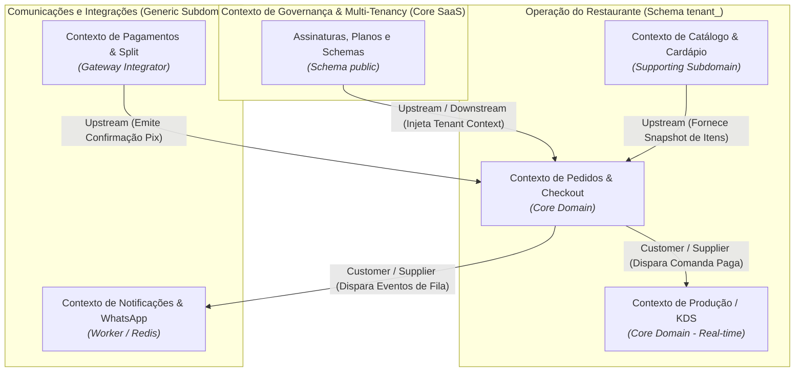

# Mapa de Contextos Delimitados (DDD) — CardápioHub

**Projeto:** CardápioHub (SaaS Multi-tenant de Cardápio Digital, Pedidos e KDS)  
**Autor:** Bernardo Gabriel Baú  
**Conformidade:** Item 2.4 da Etapa 2 do Guia do Projeto Integrador  
**Referência Teórica:** EVANS, Eric (2003); VERNON, Vaughn (2013) — Encontro 08 (Introdução ao DDD)

---

## 1. Glossário de Linguagem Ubíqua

Conforme estabelecido no Encontro 08 (*"O negócio diz 'associado', o código não pode dizer 'user_record'"*), o CardápioHub padroniza o vocabulário do domínio para unificar a comunicação entre produto e código-fonte:

| Termo Ubíquo | Significado no Domínio do Food Service | Representação Técnica no Código |
| :--- | :--- | :--- |
| **Tenant / Restaurante** | Estabelecimento de alimentação assinante da plataforma SaaS. | Objeto de governança no schema `public.tenants` e namespace `tenant_<id>`. |
| **Cardápio / Catálogo** | Conjunto organizado de categorias e itens ofertados para venda digital. | Módulo `catalog` no schema do tenant. |
| **Item de Cardápio** | Alimento ou bebida disponível para compra (ex.: *Xis Bacon*, *Pizza Margherita*). | Entidade `Item` com preços e flags de disponibilidade. |
| **Opcional / Complemento** | Personalização selecionável pelo cliente (ex.: borda de catupiry, maionese extra, ponto da carne). | Objeto de valor semi-estruturado armazenado em coluna `JSONB`. |
| **Pedido (Order)** | Intenção de compra consolidada contendo itens, endereço, modalidade (salão/delivery) e valor total. | Agregado `Pedido` com ciclo de vida de status. |
| **Comanda** | Instrumento de controle de consumo atribuído a uma mesa ou identificador de cliente. | Entidade `Comanda` associada a pedidos ativos. |
| **Ticket KDS** | Ficha eletrônica de preparo exibida na tela da cozinha, ordenada por tempo decorrido. | Projeção em tempo real transmitida via WebSockets para a equipe de cozinha. |
| **Chave Pix (Cobrança)** | Cobrança dinâmica com QR Code emitida para quitação imediata do pedido. | Objeto de valor vinculado à transação no Gateway. |

---

## 2. Bounded Contexts (Contextos Delimitados) Mapeados

O domínio do CardápioHub foi decomposto em cinco contextos delimitados (*Bounded Contexts*), respeitando as fronteiras de significado do negócio:

### 2.1. Contexto de Governança e Multi-Tenancy (Core SaaS)
* **Objetivo:** Gestão de contas de lojistas, faturamento de assinaturas SaaS (R$ 99/mês vs R$ 899/mês) e provisionamento automatizado de novos ambientes.
* **Persistência:** Schema central `public` (`tenants`, `assinaturas`, `usuarios_globais`).
* **Responsável Técnico:** `API Backend & WS` e `Worker de Filas` (executando jobs de provisionamento com `node-pg-migrate`).

### 2.2. Contexto de Catálogo e Cardápio (Supporting Subdomain)
* **Objetivo:** Administração e renderização de categorias, pratos, regras de montagem e controle de disponibilidade de estoque imediato.
* **Persistência:** Schema `tenant_<id>.categorias`, `tenant_<id>.itens`, `tenant_<id>.opcionais`.
* **Características:** Otimizado para leitura rápida no `Cardápio Web` (Next.js SSR).

### 2.3. Contexto de Pedidos e Checkout (Core Domain)
* **Objetivo:** Orquestração transacional da compra: carrinho, cálculo de acréscimos, validação de regras de entrega e emissão de cobranças Pix.
* **Persistência:** Schema `tenant_<id>.pedidos`, `tenant_<id>.pedido_itens`.
* **Garantias:** Idempotência estrita via chave `X-Idempotency-Key` e lock de processamento.

### 2.4. Contexto de Produção / KDS (Core Domain)
* **Objetivo:** Gestão visual do fluxo de trabalho na cozinha (*Kitchen Display System*).
* **Comunicação:** Totalmente orientado a eventos em tempo real via **WebSockets (WSS)**. Uma comanda transita de `NA_FILA` → `EM_PREPARO` → `PRONTO` com latência de interface inferior a 30 ms.

### 2.5. Contexto de Notificações e Comunicações (Generic Subdomain)
* **Objetivo:** Desacoplamento assíncrono para entrega de mensagens transacionais no celular do consumidor (Evolution API / Twilio) e emissão de webhooks para parceiros (ex.: painel físico de senhas).
* **Motor:** Filas Redis 7 gerenciadas via BullMQ no `Worker de Filas`.

---

## 3. Mapa de Relações entre Contextos (Context Map)

| Contexto Origem | Contexto Destino | Relação de DDD | Padrão de Integração Técnica |
| :--- | :--- | :--- | :--- |
| **Governança Multi-Tenant** | **Pedidos & Checkout** | **Upstream / Downstream (U/D)** | Injeção de contexto de tenant via JWT e `search_path` no middleware Fastify. |
| **Catálogo** | **Pedidos & Checkout** | **Upstream / Downstream** | Ao criar o pedido, um snapshot imutável dos preços e nomes dos itens é persistido na comanda para blindar variações futuras de preço. |
| **Gateway Pagamento** | **Pedidos & Checkout** | **Anti-Corruption Layer (ACL)** | Um adaptador traduz o payload de webhook proprietário da adquirente em um evento de domínio padronizado (`PagamentoAprovadoEvent`). |
| **Pedidos & Checkout** | **Cozinha (KDS)** | **Customer / Supplier (C/S)** | Pedidos confirmados geram tickets KDS transmitidos via WebSocket Gateway. |
| **Pedidos & Checkout** | **Notificações** | **Customer / Supplier (C/S)** | Mudanças de status de pedido emitem mensagens assíncronas nas filas BullMQ do Redis. |

---

## 4. Alinhamento com o Modelo C4 da Etapa 2

As fronteiras dos Bounded Contexts coincidem diretamente com os containers e componentes definidos no C4 Nível 2 e Nível 3:
* O **Core Domain (Pedidos e KDS)** opera na `API Backend & WS` com WebSockets;
* O **Subdomínio de Suporte (Catálogo)** é consumido pelo `Cardápio Web`;
* Os **Subdomínios Genéricos (Notificações e Provisionamento)** são isolados no container `Worker de Filas`, garantindo que lentidões de terceiros não afetem o domínio principal.
