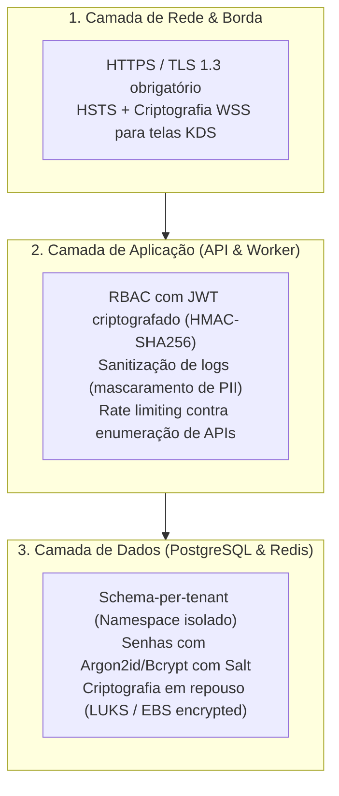

# Mapeamento e Conformidade LGPD — CardápioHub

**Projeto:** CardápioHub (SaaS Multi-tenant de Cardápio Digital, Pedidos e KDS)  
**Autor:** Bernardo Gabriel Baú  
**Conformidade:** Item 1.5 da Etapa 1 e Item 3.5 da Etapa 3 do Guia do Projeto Integrador  
**Legislação de Referência:** Lei Geral de Proteção de Dados Pessoais (Lei Federal nº 13.709/2018)

---

## 1. Classificação dos Papéis no CardápioHub

Conforme a LGPD:
* **Controlador dos Dados:** O estabelecimento comercial assinante (ex.: *Lancheria Xis do Gaúcho* ou *Pizzaria Suprema Express*), que define a relação comercial com o consumidor final.
* **Operador dos Dados:** A plataforma **CardápioHub**, que processa e armazena os dados sob as diretrizes do contrato de prestação de serviços SaaS.
* **Titulares:** Gestores do restaurante, colaboradores operacionais e consumidores finais que realizam pedidos pelo cardápio digital.

---

## 2. Inventário de Dados Pessoais por Categoria de Titular

| Categoria do Titular | Dados Pessoais Coletados | Finalidade no SaaS | Base Legal (Art. 7 LGPD) | Camada de Armazenamento | Tempo de Retenção |
| :--- | :--- | :--- | :--- | :--- | :--- |
| **Gestor / Dono** | Nome completo, e-mail corporativo, CPF/CNPJ, telefone WhatsApp, senha (hash). | Criação de conta, faturamento da assinatura SaaS, autenticação administrativa e comunicação de suporte. | Inciso V (Execução de contrato) | Schema `public` (`usuarios_globais`, `tenants`) | Enquanto a assinatura estiver ativa + 5 anos (fins fiscais). |
| **Colaborador (KDS/Caixa)** | Nome/Apelido, e-mail ou login interno, perfil de acesso (Role). | Controle de acesso baseado em função (RBAC) e auditoria de ações no KDS. | Inciso V (Execução de contrato) | Schema `tenant_<id>` (`usuarios`) | Duração do vínculo de trabalho do restaurante. |
| **Consumidor Final** | Nome, número de telefone (WhatsApp), endereço de entrega (se delivery), observações do pedido. | Identificação da comanda, entrega física do alimento e notificação de status de preparo via WhatsApp. | Inciso V (Execução de contrato do pedido) e Inciso IX (Legítimo interesse) | Schema `tenant_<id>` (`pedidos`, `enderecos`) | 6 meses para histórico operacional; 5 anos para registros fiscais agregados. |
| **Transações Financeiras** | Identificador Pix (`endToEndId`), valor, data/hora da transação, status. *(Não coletamos nem armazenamos número de cartão de crédito)*. | Liquidação do pedido e conciliação bancária via Gateway. | Inciso II (Cumprimento de obrigação legal/fiscal) | Schema `tenant_<id>` (`transacoes_pagamento`) | 5 anos (Código Tributário Nacional). |

> [!NOTE]
> **Cartões de Crédito:** Os dados sensíveis de pagamento em cartão (número, CVV, validade) trafegam de ponta a ponta criptografados diretamente do frontend para o Gateway de Pagamento homologado (PCI-DSS compliant). O CardápioHub **nunca armazena dados de cartão** em seus bancos ou logs.

---

## 3. Riscos de Vazamento entre Tenants e Medidas de Mitigação

Em um modelo multi-tenant, o risco de conformidade mais grave é o **vazamento horizontal de dados** (um restaurante concorrente acessar histórico de clientes, endereços ou faturamento de outro).

| Vetor de Risco | Probabilidade / Impacto | Medida Técnica Implementada no CardápioHub |
| :--- | :--- | :--- |
| **Vazamento por falha em consulta SQL (esquecimento de `WHERE tenant_id`)** | Alta prob. em shared schema / Impacto Crítico | **Adoção do modelo Schema-per-tenant ([ADR-001](file:///Users/bernardobau/01-Codes/CardapioHub/docs/adr/ADR-001-modelo-de-tenancy.md)):** Isolamento físico de tabelas em namespaces SQL separados (`tenant_123.pedidos`). Uma consulta sem qualificação nunca retorna dados de outro lojista. |
| **Vazamento em logs de aplicação e filas** | Média prob. / Alto impacto | **Sanitização de Logs:** Mascaramento automático de telefones e identificadores nos logs do Fastify e BullMQ (ex.: `+55 (55) 999**-**12`). |
| **Exfiltração de dados em trânsito** | Baixa prob. / Alto impacto | **Criptografia TLS 1.3:** Todas as conexões públicas (HTTPS e WSS) exigem certificados SSL com HSTS ativado. |
| **Contaminação de dados no KDS** | Média prob. / Alto impacto | **Salas WebSocket isoladas por Tenant:** Clientes KDS só podem subscrever canais `room:tenant_<id>:kds` após handshake validado com JWT assinado. |

---

## 4. Medidas Técnicas por Camada da Arquitetura



1. **Camada de Borda e Transporte:**
   - Tráfego HTTPS obrigatório em todas as URLs públicas (`/cardapio`) e administrativas (`/painel`);
   - WebSockets criptografados (`wss://`) para comunicação em tempo real com as telas KDS na cozinha.
2. **Camada de Aplicação (`API Backend & WS` e `Worker de Filas`):**
   - Senhas criptografadas utilizando hash moderno com salt;
   - Tokens JWT com tempo de expiração curto (15 minutos) e refresh tokens rotativos armazenados com hash;
   - Sanitização de dados pessoais em trilhas de auditoria e ferramentas de monitoramento.
3. **Camada de Persistência (PostgreSQL 16):**
   - Segregação por schema isolado (`tenant_<id>`);
   - Suporte a backups pontuais e restauração isolada por tenant (`pg_dump -n tenant_123`);
   - Dados em repouso protegidos por criptografia de disco.

---

## 5. Atendimento aos Direitos dos Titulares (Art. 18 LGPD)

* **Direito de Acesso e Portabilidade:** O lojista pode exportar todo o histórico de comandas e itens cadastrados em formato padronizado JSON/CSV diretamente no painel administrativo.
* **Direito de Eliminação / Esquecimento:**
  - Caso um restaurante encerre a assinatura ou um titular exija expurgo definitivo, a deleção é atômica e limpa via comando:
    ```sql
    DROP SCHEMA tenant_<id> CASCADE;
    DELETE FROM public.tenants WHERE id = '<id>';
    ```
  - Isso garante que nenhum resquício de dados permaneça em tabelas operacionais compartilhadas, eliminando a complexidade de rodar `DELETE` com cascata em tabelas de milhões de linhas.
